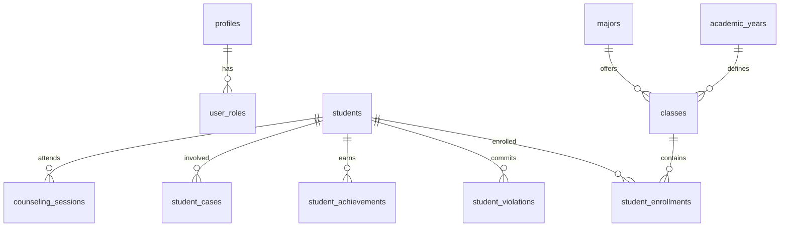

# DOKUMENTASI LENGKAP APLIKASI SI-KAJI
**Sistem Informasi Kesiswaan SMK Negeri 1 Kendal**

---

## 📑 DAFTAR ISI

1. [Ringkasan Eksekutif](#ringkasan-eksekutif)
2. [Arsitektur Aplikasi](#arsitektur-aplikasi)
3. [Struktur Database](#struktur-database)
4. [Sistem Role & Permission](#sistem-role--permission)
5. [Modul dan Fitur](#modul-dan-fitur)
6. [Dashboard Interaktif](#dashboard-interaktif)
7. [Sistem Keamanan](#sistem-keamanan)
8. [Integrasi AI](#integrasi-ai)
9. [File Storage](#file-storage)
10. [API dan Functions](#api-dan-functions)
11. [Deployment & Production](#deployment--production)
12. [Panduan Penggunaan](#panduan-penggunaan)
13. [Troubleshooting](#troubleshooting)
14. [Roadmap Pengembangan](#roadmap-pengembangan)

---

## 📋 RINGKASAN EKSEKUTIF

### Tentang Si-Kaji
Si-Kaji (Sistem Informasi Kesiswaan SMKJI) adalah aplikasi web terpadu yang dirancang khusus untuk mengelola seluruh aspek kesiswaan di SMK Negeri 1 Kendal. Aplikasi ini mengintegrasikan 17 modul utama dalam satu platform untuk menciptakan ekosistem digital yang komprehensif.

### Status Proyek
- **Tingkat Kelengkapan**: 85%
- **Status**: Production Ready untuk fitur utama
- **Total Fitur**: 17 modul dengan 50+ sub-fitur
- **Database Tables**: 53 tabel dengan relasi kompleks
- **User Roles**: 14 role berbeda dengan akses terdifferensiasi

### Key Features
- ✅ Manajemen data siswa lengkap
- ✅ Sistem presensi mandiri dengan geolocation
- ✅ Manajemen pelanggaran dan prestasi
- ✅ Sistem perizinan digital
- ✅ Portal konseling BK
- ✅ Manajemen ekstrakurikuler
- ✅ Analytics dan reporting
- ✅ AI Assistant terintegrasi

---

## 🏗️ ARSITEKTUR APLIKASI

### Tech Stack
```
Frontend:
├── React 18.3.1 (UI Library)
├── TypeScript (Type Safety)
├── Vite (Build Tool)
├── Tailwind CSS (Styling)
├── Shadcn/UI (UI Components)
├── Radix UI (Primitives)
├── React Router DOM (Routing)
├── React Query (State Management)
├── React Hook Form (Form Handling)
├── Date-fns (Date Utilities)
├── Recharts (Data Visualization)
└── Lucide React (Icons)

Backend:
├── Supabase (BaaS Platform)
├── PostgreSQL (Database)
├── Row Level Security (RLS)
├── Edge Functions (Serverless)
├── Storage Buckets (File Storage)
└── Real-time Subscriptions
```

### Folder Structure
```
src/
├── components/          # Reusable UI components
│   ├── achievements/    # Achievement management
│   ├── ai/             # AI assistant components
│   ├── analytics/      # Analytics & reporting
│   ├── attendance/     # Attendance system
│   ├── auth/           # Authentication
│   ├── cases/          # Case management
│   ├── common/         # Shared components
│   ├── counseling/     # Counseling system
│   ├── dashboard/      # Dashboard components
│   ├── documents/      # Document management
│   ├── extracurricular/# Extracurricular management
│   ├── homeroom/       # Homeroom teacher tools
│   ├── layout/         # Layout components
│   ├── masterData/     # Master data management
│   ├── notifications/  # Notification system
│   ├── parent/         # Parent portal
│   ├── permits/        # Permission system
│   ├── proposals/      # Activity proposals
│   ├── student/        # Student management
│   ├── ui/             # Base UI components
│   ├── user/           # User management
│   └── violations/     # Violation management
├── hooks/              # Custom React hooks
├── integrations/       # External integrations
├── pages/              # Page components
├── types/              # TypeScript definitions
└── utils/              # Utility functions
```

### Component Architecture
- **Atomic Design Pattern**: Atoms → Molecules → Organisms → Templates → Pages
- **Compound Components**: Complex UI components with multiple parts
- **Custom Hooks**: Reusable business logic
- **Context Providers**: Global state management
- **Error Boundaries**: Graceful error handling

---

## 🗄️ STRUKTUR DATABASE

### Overview Database
- **Total Tables**: 53 tables
- **Database Engine**: PostgreSQL 15+
- **Security**: Row Level Security (RLS) enabled
- **Functions**: 25+ custom functions
- **Triggers**: 10+ automated triggers
- **Enums**: 5 custom enum types

### Core Tables Categories

#### 1. User Management (7 tables)
```sql
-- Core user tables
profiles                 -- User profiles and basic info
user_roles              -- User role assignments
user_preferences        -- User settings and preferences
user_notification_preferences -- Notification settings
permissions             -- Available permissions
role_permissions        -- Role-permission mapping
parent_access          -- Parent access to student data
```

#### 2. Academic Structure (6 tables)
```sql
-- Academic organization
academic_years         -- School years
semesters             -- Semester periods
classes               -- Class definitions
majors                -- Study programs/majors
students              -- Student master data
student_enrollments   -- Student class enrollments
```

#### 3. Attendance System (5 tables)
```sql
-- Attendance management
attendance_locations      -- Valid attendance locations
attendance_schedules     -- Attendance time schedules
student_attendances      -- Manual attendance records
student_self_attendances -- Self-attendance with geolocation
violation_types          -- Types of violations
```

#### 4. Discipline & Achievement (5 tables)
```sql
-- Student behavior tracking
student_violations          -- Violation records
student_achievements       -- Achievement records
achievement_types          -- Types of achievements
student_discipline_points  -- Calculated discipline scores
```

#### 5. Case Management (3 tables)
```sql
-- Case handling system
student_cases         -- Reported cases
case_activities      -- Case activity logs
case_assignments     -- Case assignment to handlers
```

#### 6. Counseling System (1 table)
```sql
-- Guidance and counseling
counseling_sessions  -- BK counseling sessions
```

#### 7. Extracurricular (4 tables)
```sql
-- Extracurricular activities
extracurriculars                    -- Activity definitions
extracurricular_enrollments        -- Student enrollments
coach_attendances                  -- Coach attendance records
coach_activity_logs               -- Coach activity journals
student_extracurricular_attendances -- Student participation
```

#### 8. Permission System (2 tables)
```sql
-- Student permissions
student_permits    -- Permission requests
permit_approvals   -- Approval workflow
```

#### 9. Activity Proposals (2 tables)
```sql
-- Student activity proposals
activity_proposals    -- Proposal submissions
proposal_approvals   -- Approval workflow
```

#### 10. Document Management (4 tables)
```sql
-- Document repository
document_repository   -- Document storage
document_categories  -- Document categorization
document_versions    -- Version control
letter_templates     -- Letter templates
letter_requests      -- Letter request system
```

#### 11. Homeroom Management (2 tables)
```sql
-- Homeroom teacher tools
homeroom_journals        -- Daily journals
journal_student_entries  -- Individual student entries
```

#### 12. Notification System (4 tables)
```sql
-- Notification infrastructure
notifications              -- Notification records
notification_templates     -- Message templates
notification_channels      -- Delivery channels
notification_queue         -- Delivery queue
```

#### 13. AI Integration (3 tables)
```sql
-- AI system
ai_preferences      -- AI user preferences
ai_recommendations  -- AI-generated recommendations
ai_usage_logs      -- AI usage tracking
```

#### 14. System Monitoring (3 tables)
```sql
-- System logs and monitoring
activity_logs    -- User activity tracking
error_logs       -- Error logging
```

#### 15. Master Data (2 tables)
```sql
-- School infrastructure
school_facilities  -- School facility definitions
```

### Database Relationships


### Key Database Features

#### Row Level Security (RLS)
- **Enabled on all sensitive tables**
- **User-based data isolation**
- **Role-based access control**
- **Automatic policy enforcement**

#### Custom Functions
```sql
-- Key database functions
generate_case_number()           -- Auto-generate case numbers
recalculate_discipline_points()  -- Calculate student discipline scores
create_notification()            -- Create system notifications
log_activity()                   -- Log user activities
is_admin()                       -- Check admin permissions
```

#### Triggers
- **Auto case number generation**
- **Discipline point recalculation**
- **Activity logging**
- **Violation detection**
- **Notification creation**

---

## 👥 SISTEM ROLE & PERMISSION

### Hierarki Role
```
Level 1 (Highest Authority)
├── Admin Sistem
└── Kepala Sekolah

Level 2 (Management)
├── Waka Kesiswaan
└── Admin Kesiswaan

Level 3 (Specialized Teams)
├── TPPK (Anti-Violence)
├── ARPS (Dropout Prevention)
├── P4GN (Anti-Drug)
└── Koordinator Ekstrakurikuler

Level 4 (Educational Staff)
├── Wali Kelas
├── Guru BK
└── PJ Sarpras

Level 5 (Instructors)
└── Pelatih Ekstrakurikuler

Level 6 (End Users)
├── Siswa
└── Orang Tua
```

### Detail Role Specifications

#### 1. Admin Sistem
**Kode**: `admin`
**Level**: Super Admin
**Kewenangan**:
- ✅ Full system access
- ✅ User management
- ✅ System configuration
- ✅ Master data management
- ✅ All module access
- ✅ System monitoring & logs

**Dashboard Features**:
- System health monitoring
- User activity analytics
- Database statistics
- Error logs and debugging
- Performance metrics

#### 2. Siswa
**Kode**: `siswa`
**Level**: End User
**Kewenangan**:
- ✅ Personal data access
- ✅ Self-attendance
- ✅ Permission requests
- ✅ Achievement submissions
- ✅ Case reporting
- ✅ Counseling requests
- ✅ Activity proposal submissions

**Dashboard Features**:
- Personal statistics
- Attendance summary
- Discipline points
- Achievement records
- Pending requests
- Schedule overview

#### 3. Wali Kelas
**Kode**: `wali_kelas`
**Level**: Teacher
**Kewenangan**:
- ✅ Student data (homeroom class)
- ✅ Violation recording
- ✅ Achievement verification
- ✅ Permission approvals
- ✅ Homeroom journal
- ✅ Parent communication

**Dashboard Features**:
- Class overview
- Student performance
- Discipline statistics
- Pending approvals
- Journal reminders

#### 4. Guru BK
**Kode**: `guru_bk`
**Level**: Counselor
**Kewenangan**:
- ✅ Counseling sessions
- ✅ Case referrals
- ✅ Student mental health data
- ✅ Counseling schedules
- ✅ Encrypted notes

**Dashboard Features**:
- Counseling calendar
- Active cases
- Student referrals
- Session statistics
- Follow-up reminders

#### 5. TPPK
**Kode**: `tppk`
**Level**: Specialist
**Kewenangan**:
- ✅ Violence case handling
- ✅ Manual attendance input
- ✅ Violation recording
- ✅ Case investigation
- ✅ Student safety monitoring

**Dashboard Features**:
- Active violence cases
- Case assignment queue
- Investigation progress
- Safety alerts
- Trending issues analysis

#### 6. Orang Tua
**Kode**: `orang_tua`
**Level**: Parent
**Kewenangan**:
- ✅ Child's data monitoring
- ✅ Attendance tracking
- ✅ Performance reports
- ✅ Notification receiving
- ❌ No data modification

**Dashboard Features**:
- Child performance overview
- Attendance patterns
- Discipline status
- Achievement highlights
- Communication logs

#### 7. Pelatih Ekstrakurikuler
**Kode**: `pelatih_eskul`
**Level**: Instructor
**Kewenangan**:
- ✅ Coach attendance input
- ✅ Activity logging
- ✅ Student progress tracking
- ✅ Training documentation
- ✅ Equipment requests

**Dashboard Features**:
- Training schedule
- Student participation
- Progress tracking
- Activity logs
- Resource requests

### Permission Matrix
| Module | Admin | Siswa | Wali Kelas | Guru BK | TPPK | Orang Tua | Pelatih |
|--------|-------|-------|------------|---------|------|-----------|---------|
| User Management | ✅ | ❌ | ❌ | ❌ | ❌ | ❌ | ❌ |
| Student Data | ✅ | 👤 | 🏫 | 📊 | 📊 | 👶 | ❌ |
| Attendance | ✅ | ✅ | ✅ | 📊 | ✅ | 📊 | ❌ |
| Violations | ✅ | 📊 | ✅ | 📊 | ✅ | 📊 | ❌ |
| Achievements | ✅ | ✅ | ✅ | 📊 | ❌ | 📊 | ❌ |
| Cases | ✅ | ✅ | 📊 | ✅ | ✅ | ❌ | ❌ |
| Counseling | ✅ | ✅ | 📊 | ✅ | 📊 | ❌ | ❌ |
| Permits | ✅ | ✅ | ✅ | 📊 | ✅ | 📊 | ❌ |
| Extracurricular | ✅ | ✅ | 📊 | ❌ | ❌ | 📊 | ✅ |
| Documents | ✅ | 📊 | 📊 | 📊 | 📊 | 📊 | 📊 |

**Legend**:
- ✅ Full Access
- 📊 Read Only
- 👤 Own Data Only
- 🏫 Class Data Only
- 👶 Child Data Only
- ❌ No Access

---

## 🎯 MODUL DAN FITUR

### Phase 1: Foundation & Infrastructure ✅ **SELESAI**

#### 1.1 Modul Manajemen Pengguna & Hak Akses ✅
**Status**: Lengkap 100%
**File Utama**: 
- `/src/pages/UserManagement.tsx`
- `/src/components/user/`
- `/src/hooks/useAuth.tsx`

**Fitur Implementasi**:
- ✅ Supabase Authentication integration
- ✅ 14 role system dengan RBAC
- ✅ User registration dan profile management
- ✅ Bulk user import (Excel/CSV)
- ✅ Role assignment dan management
- ✅ User activity logging
- ✅ Login/logout dengan session management

**Database Tables**: `profiles`, `user_roles`, `role_permissions`, `permissions`

#### 1.2 Modul Manajemen Master Data Sekolah ✅
**Status**: Lengkap 100%
**File Utama**: `/src/pages/MasterData.tsx`

**Fitur Implementasi**:
- ✅ Academic year management
- ✅ Semester management
- ✅ Class dan major management
- ✅ Violation types dengan point system
- ✅ Achievement types dengan reward points
- ✅ Extracurricular definitions
- ✅ School facility management
- ✅ Location-based attendance setup

**Database Tables**: `academic_years`, `semesters`, `classes`, `majors`, `violation_types`, `achievement_types`, `extracurriculars`, `school_facilities`, `attendance_locations`

#### 1.3 Dashboard Basic ✅
**Status**: Lengkap 100%
**File Utama**: `/src/pages/Dashboard.tsx`

**Fitur Implementasi**:
- ✅ Role-based dashboard layout
- ✅ Real-time statistics
- ✅ Interactive charts dan widgets
- ✅ Navigation menu dengan role visibility
- ✅ Responsive design
- ✅ Dark/light theme support

**Components**: `DashboardHome`, `StudentDashboard`, `HomeroomTeacherDashboard`, `EnhancedDashboard`

---

### Phase 2: Core Student Management ✅ **SELESAI**

#### 2.1 Modul Manajemen Data Induk Kesiswaan ✅
**Status**: Lengkap 100%
**File Utama**: `/src/pages/StudentManagement.tsx`

**Fitur Implementasi**:
- ✅ Complete CRUD student data
- ✅ Excel/CSV import/export
- ✅ Student photo upload
- ✅ Parent/guardian data
- ✅ Academic history tracking
- ✅ Enrollment management
- ✅ Student status tracking
- ✅ Advanced search dan filtering

**Database Tables**: `students`, `student_enrollments`

#### 2.2 Sistem Presensi & Disiplin Siswa ✅
**Status**: Lengkap 90% (kurang RFID integration)
**File Utama**: `/src/pages/AttendanceManagement.tsx`

**Fitur Implementasi**:
- ✅ Self-attendance dengan geolocation
- ✅ Manual attendance input
- ✅ Violation recording dengan point system
- ✅ Achievement recording dengan rewards
- ✅ Automatic late violation detection
- ✅ Discipline point calculation
- ✅ Attendance schedule management
- ❌ RFID/QR Code integration (planned)

**Database Tables**: `student_attendances`, `student_self_attendances`, `student_violations`, `student_achievements`, `student_discipline_points`, `attendance_schedules`, `attendance_locations`

#### 2.3 Sistem Perizinan & Dispensasi Online ✅
**Status**: Lengkap 100%
**File Utama**: `/src/pages/PermitManagement.tsx`

**Fitur Implementasi**:
- ✅ Online permission request form
- ✅ Multi-level approval workflow
- ✅ Status tracking dan notifications
- ✅ Letter generation dan printing
- ✅ Document attachment support
- ✅ Approval history tracking

**Database Tables**: `student_permits`, `permit_approvals`

---

### Phase 3: Advanced Student Services ⚠️ **SEBAGIAN**

#### 3.1 Sistem Pengaduan & Pelaporan Kasus ✅
**Status**: Lengkap 100%
**File Utama**: `/src/pages/CaseManagement.tsx`

**Fitur Implementasi**:
- ✅ Anonymous case reporting
- ✅ Case categorization (bullying, drugs, violence, etc.)
- ✅ Auto-assignment to specialized teams (TPPK, ARPS, P4GN)
- ✅ Case tracking dan status updates
- ✅ Evidence attachment support
- ✅ Case activity logging
- ✅ Resolution tracking

**Database Tables**: `student_cases`, `case_activities`, `case_assignments`

#### 3.2 Portal Orang Tua ✅
**Status**: Basic Complete 80%
**File Utama**: `/src/pages/ParentPortal.tsx`

**Fitur Implementasi**:
- ✅ Child monitoring dashboard
- ✅ Attendance tracking
- ✅ Performance reports
- ✅ Discipline status
- ✅ Achievement highlights
- ⚠️ Real-time notifications (basic)
- ❌ WhatsApp integration (planned)

**Database Tables**: `parent_access`

#### 3.3 Sistem Pelayanan Bimbingan Konseling ✅
**Status**: Lengkap 100%
**File Utama**: `/src/pages/CounselingManagement.tsx`

**Fitur Implementasi**:
- ✅ Counseling session scheduling
- ✅ Calendar integration
- ✅ Encrypted counseling notes
- ✅ Case referral integration
- ✅ Follow-up scheduling
- ✅ Student counseling requests
- ✅ Progress tracking

**Database Tables**: `counseling_sessions`

---

### Phase 4: Activity & Document Management ⚠️ **SEBAGIAN**

#### 4.1 Sistem Perencanaan & Proposal Kegiatan ✅
**Status**: Lengkap 100%
**File Utama**: `/src/pages/ActivityProposal.tsx`

**Fitur Implementasi**:
- ✅ Activity proposal submission
- ✅ Multi-level approval workflow
- ✅ Budget planning integration
- ✅ Facility booking integration
- ✅ Document attachment
- ✅ Activity reporting (LPJ)
- ✅ Proposal tracking

**Database Tables**: `activity_proposals`, `proposal_approvals`

#### 4.2 Manajemen Ekstrakurikuler ✅
**Status**: Lengkap 100%
**File Utama**: `/src/pages/ExtracurricularManagement.tsx`

**Fitur Implementasi**:
- ✅ Extracurricular definitions
- ✅ Student enrollment
- ✅ Coach attendance tracking
- ✅ Activity logging
- ✅ Progress reporting
- ✅ Schedule management
- ✅ Performance evaluation

**Database Tables**: `extracurriculars`, `extracurricular_enrollments`, `coach_attendances`, `coach_activity_logs`, `student_extracurricular_attendances`

#### 4.3 Sistem Permohonan Surat & Mutasi ⚠️
**Status**: Basic 60%
**File Utama**: `/src/components/letters/`

**Fitur Implementasi**:
- ✅ Letter request system
- ✅ Template management
- ✅ Auto letter generation
- ❌ Complete mutation process (basic only)
- ❌ Integration with external systems

**Database Tables**: `letter_requests`, `letter_templates`

---

### Phase 5: Administrative Tools ⚠️ **SEBAGIAN**

#### 5.1 Sistem Jurnal Perwalian ✅
**Status**: Lengkap 100%
**File Utama**: `/src/pages/HomeroomJournalManagement.tsx`

**Fitur Implementasi**:
- ✅ Digital homeroom journal
- ✅ Individual student entries
- ✅ Behavioral tracking
- ✅ Academic progress notes
- ✅ Daily activity logging
- ✅ Report generation

**Database Tables**: `homeroom_journals`, `journal_student_entries`

#### 5.2 Repositori Dokumen ✅
**Status**: Lengkap 100%
**File Utama**: `/src/pages/DocumentManagement.tsx`

**Fitur Implementasi**:
- ✅ Document upload/download
- ✅ Category management
- ✅ Version control
- ✅ Search functionality
- ✅ Access control
- ✅ Document approval workflow

**Database Tables**: `document_repository`, `document_categories`, `document_versions`

---

### Phase 6: Enhancement & Integration ⚠️ **SEBAGIAN**

#### 6.1 Sistem Notifikasi Terpusat ⚠️
**Status**: Basic 40%
**File Utama**: `/src/pages/NotificationManagement.tsx`

**Fitur Implementasi**:
- ✅ In-app notifications
- ✅ Notification templates
- ✅ User preferences
- ❌ WhatsApp integration (planned)
- ❌ Email notifications (planned)
- ❌ SMS integration (planned)

**Database Tables**: `notifications`, `notification_templates`, `notification_channels`, `notification_queue`, `user_notification_preferences`

#### 6.2 Advanced Dashboard & Analytics ✅
**Status**: Lengkap 100%
**File Utama**: `/src/pages/AdvancedAnalytics.tsx`

**Fitur Implementasi**:
- ✅ Comprehensive reporting
- ✅ Data visualization
- ✅ Export capabilities
- ✅ Predictive analytics
- ✅ Real-time statistics
- ✅ Custom dashboards

#### 6.3 Advanced Features ⚠️
**Status**: Sebagian 60%

**Fitur Implementasi**:
- ✅ Audit trail lengkap
- ✅ Global search system
- ✅ Mobile responsive design
- ✅ AI Assistant integration
- ❌ RFID/QR Code integration
- ❌ Native mobile app

---

## 📊 DASHBOARD INTERAKTIF

### Student Dashboard
**Route**: `/dashboard` (role: siswa)
**Components**: `StudentDashboard.tsx`

**Widgets**:
- **Personal Stats Card**: Attendance rate, discipline points, achievements
- **Today's Schedule**: Classes, extracurricular activities
- **Quick Actions**: Self-attendance, request permission, report case
- **Recent Activities**: Latest achievements, violations, counseling sessions
- **Notification Center**: Important announcements and reminders

**Charts**:
- Attendance trend (line chart)
- Discipline points over time
- Monthly achievement progress

### Homeroom Teacher Dashboard
**Route**: `/dashboard` (role: wali_kelas)
**Components**: `HomeroomTeacherDashboard.tsx`

**Widgets**:
- **Class Overview**: Total students, attendance rate, active cases
- **Today's Priorities**: Pending approvals, journal reminders
- **Student Alerts**: Low attendance, discipline issues, achievements
- **Quick Actions**: Record violation, approve permission, update journal

**Charts**:
- Class attendance patterns
- Discipline trends by student
- Performance distribution

### Admin Dashboard
**Route**: `/dashboard` (role: admin)
**Components**: `EnhancedDashboard.tsx`

**Widgets**:
- **System Health**: Database status, active users, system load
- **Key Metrics**: Total students, active cases, recent activities
- **Module Usage**: Most used features, user engagement
- **Alerts**: System errors, security issues, maintenance needed

**Charts**:
- User activity heatmap
- Module usage statistics
- System performance metrics

### Dashboard Features

#### Real-time Updates
- WebSocket connections untuk live data
- Auto-refresh every 30 seconds
- Push notifications untuk critical updates

#### Interactive Elements
- Clickable chart elements
- Drill-down capabilities
- Context menus untuk quick actions
- Responsive tooltips

#### Customization
- Widget arrangement (drag & drop)
- Theme preferences (dark/light)
- Chart type selection
- Time range filters

---

## 🔒 SISTEM KEAMANAN

### Authentication
**Provider**: Supabase Auth
**Methods**:
- ✅ Email/Password
- ✅ Magic Links
- ❌ Google OAuth (configurable)
- ❌ GitHub OAuth (configurable)

**Session Management**:
- JWT tokens dengan refresh
- Automatic session renewal
- Secure logout
- Session timeout handling

### Row Level Security (RLS)
**Implementation**: PostgreSQL RLS policies

**Key Policies**:
```sql
-- Students can only see their own data
CREATE POLICY "Students see own data" ON students
FOR SELECT USING (user_id = auth.uid());

-- Teachers can see their homeroom students
CREATE POLICY "Teachers see homeroom students" ON students
FOR SELECT USING (
  EXISTS (
    SELECT 1 FROM user_roles ur
    WHERE ur.user_id = auth.uid()
    AND ur.role = 'wali_kelas'
    AND ur.is_active = true
  )
);

-- Admins can see all data
CREATE POLICY "Admins see all" ON students
FOR ALL USING (
  EXISTS (
    SELECT 1 FROM user_roles ur
    WHERE ur.user_id = auth.uid()
    AND ur.role = 'admin'
    AND ur.is_active = true
  )
);
```

### Data Encryption
**Sensitive Data**:
- Counseling notes (AES-256)
- Personal identification numbers
- Contact information
- Medical records (if any)

**Implementation**:
```typescript
// Encryption for counseling notes
const encryptedNotes = await encryptData(notes, secretKey);
await supabase
  .from('counseling_sessions')
  .insert({ notes_encrypted: encryptedNotes });
```

### Audit Trail
**Tracking**:
- User login/logout
- Data modifications
- Permission changes
- System access
- File downloads

**Implementation**: `activity_logs` table dengan automatic triggers

### Security Headers
```typescript
// Security headers configuration
const securityHeaders = {
  'Content-Security-Policy': "default-src 'self'",
  'X-Frame-Options': 'DENY',
  'X-Content-Type-Options': 'nosniff',
  'Referrer-Policy': 'strict-origin-when-cross-origin',
  'Permissions-Policy': 'geolocation=(self)'
};
```

### Input Validation & Sanitization
- **Server-side validation** on all endpoints
- **Client-side validation** dengan React Hook Form + Zod
- **SQL injection prevention** dengan parameterized queries
- **XSS protection** dengan sanitization libraries

---

## 🤖 INTEGRASI AI

### AI Assistant
**File**: `/src/pages/AIManagement.tsx`
**Provider**: Configurable (OpenAI, Gemini, Claude)

**Capabilities**:
- Student performance analysis
- Behavioral pattern recognition
- Attendance prediction
- Academic recommendation
- Risk assessment

**Usage Examples**:
```typescript
// AI recommendation for at-risk students
const riskAnalysis = await aiService.analyzeStudent({
  studentId,
  attendanceData,
  disciplineHistory,
  academicPerformance
});

// Generate intervention recommendations
const recommendations = await aiService.generateRecommendations({
  studentProfile: riskAnalysis,
  interventionHistory,
  availableResources
});
```

### Predictive Analytics
**Models**:
- Dropout risk prediction
- Academic performance forecasting
- Behavioral pattern analysis
- Attendance trend prediction

**Implementation**:
```typescript
// Predictive model for dropout risk
interface DropoutRiskFactors {
  attendanceRate: number;
  disciplinePoints: number;
  academicGrade: number;
  familyBackground: string;
  extracurricularParticipation: number;
}

const riskScore = await predictDropoutRisk(factors);
```

### AI Configuration
**Settings**:
- API key management
- Model selection
- Cost monitoring
- Usage analytics
- Performance tuning

**Database Tables**: `ai_preferences`, `ai_recommendations`, `ai_usage_logs`

---

## 📁 FILE STORAGE

### Supabase Storage Buckets

#### 1. Student Photos
**Bucket**: `student-photos`
**Access**: Public
**Usage**:
- Student profile pictures
- ID card photos
- Achievement certificates

**Implementation**:
```typescript
const { data, error } = await supabase.storage
  .from('student-photos')
  .upload(`${studentId}/profile.jpg`, photoFile);
```

#### 2. Documents
**Bucket**: `documents`
**Access**: Public with RLS
**Usage**:
- Permission documents
- Case evidence
- Official letters
- Policy documents

**File Organization**:
```
documents/
├── permits/
│   ├── {student_id}/
│   └── supporting_docs/
├── cases/
│   ├── {case_id}/
│   └── evidence/
├── letters/
│   ├── generated/
│   └── templates/
└── policies/
    ├── procedures/
    └── forms/
```

### File Upload Components
**Components**:
- `FileUpload.tsx` - Base upload component
- `StudentPhotoUpload.tsx` - Specialized for photos
- `DocumentUpload.tsx` - Document handling

**Features**:
- Drag & drop interface
- Progress tracking
- File type validation
- Size limit enforcement
- Image compression
- Preview capabilities

---

## 🔧 API DAN FUNCTIONS

### Supabase Edge Functions

#### 1. AI Processor
**Path**: `/supabase/functions/ai-processor/`
**Purpose**: Process AI requests and generate insights

**Endpoints**:
- `POST /ai-processor/analyze-student`
- `POST /ai-processor/generate-recommendations`
- `POST /ai-processor/predict-performance`

#### 2. Letter Generator
**Path**: `/supabase/functions/generate-letter-pdf/`
**Purpose**: Generate PDF letters from templates

**Usage**:
```typescript
const { data } = await supabase.functions.invoke('generate-letter-pdf', {
  body: {
    templateId: 'permission-letter',
    studentData: studentInfo,
    customFields: additionalData
  }
});
```

### Custom Database Functions

#### Key Functions
```sql
-- Generate unique case numbers
CREATE OR REPLACE FUNCTION generate_case_number()
RETURNS TEXT AS $$
DECLARE
  year_part TEXT;
  counter INTEGER;
BEGIN
  year_part := TO_CHAR(CURRENT_DATE, 'YYYY');
  SELECT COUNT(*) + 1 INTO counter
  FROM student_cases
  WHERE case_number LIKE 'CASE/' || year_part || '/%';
  
  RETURN 'CASE/' || year_part || '/' || LPAD(counter::TEXT, 4, '0');
END;
$$ LANGUAGE plpgsql;

-- Recalculate discipline points
CREATE OR REPLACE FUNCTION recalculate_discipline_points(
  _student_id UUID,
  _academic_year_id UUID
)
RETURNS VOID AS $$
DECLARE
  _violation_points INTEGER := 0;
  _achievement_points INTEGER := 0;
  _final_score INTEGER;
BEGIN
  -- Calculate violation points
  SELECT COALESCE(SUM(point_deduction), 0)
  INTO _violation_points
  FROM student_violations
  WHERE student_id = _student_id AND status = 'active';

  -- Calculate achievement points
  SELECT COALESCE(SUM(point_reward), 0)
  INTO _achievement_points
  FROM student_achievements
  WHERE student_id = _student_id AND status = 'verified';

  -- Calculate final score
  _final_score := 100 - _violation_points + _achievement_points;

  -- Update or insert discipline points record
  INSERT INTO student_discipline_points (
    student_id, academic_year_id, total_violation_points,
    total_achievement_points, final_score, discipline_status
  )
  VALUES (
    _student_id, _academic_year_id, _violation_points,
    _achievement_points, _final_score,
    CASE
      WHEN _final_score >= 90 THEN 'excellent'
      WHEN _final_score >= 75 THEN 'good'
      WHEN _final_score >= 60 THEN 'warning'
      ELSE 'critical'
    END
  )
  ON CONFLICT (student_id, academic_year_id)
  DO UPDATE SET
    total_violation_points = _violation_points,
    total_achievement_points = _achievement_points,
    final_score = _final_score,
    discipline_status = CASE
      WHEN _final_score >= 90 THEN 'excellent'
      WHEN _final_score >= 75 THEN 'good'
      WHEN _final_score >= 60 THEN 'warning'
      ELSE 'critical'
    END,
    last_updated = NOW();
END;
$$ LANGUAGE plpgsql SECURITY DEFINER;
```

### API Hooks
**Custom Hooks untuk API calls**:
```typescript
// useStudentData.tsx - Student data management
export const useStudentData = () => {
  const fetchStudents = useQuery({
    queryKey: ['students'],
    queryFn: async () => {
      const { data, error } = await supabase
        .from('students')
        .select('*')
        .order('full_name');
      if (error) throw error;
      return data;
    }
  });

  const createStudent = useMutation({
    mutationFn: async (studentData: StudentData) => {
      const { data, error } = await supabase
        .from('students')
        .insert(studentData)
        .select()
        .single();
      if (error) throw error;
      return data;
    }
  });

  return { fetchStudents, createStudent };
};
```

---

## 🚀 DEPLOYMENT & PRODUCTION

### Environment Configuration
```env
# Supabase Configuration
VITE_SUPABASE_URL=https://ofquyellugscpitvpcpj.supabase.co
VITE_SUPABASE_ANON_KEY=eyJhbGciOiJIUzI1NiIsInR5cCI6IkpXVCJ9...

# App Configuration
VITE_APP_NAME=Si-Kaji
VITE_APP_VERSION=1.0.0
VITE_ENVIRONMENT=production

# AI Configuration (Optional)
VITE_OPENAI_API_KEY=sk-...
VITE_GEMINI_API_KEY=...
```

### Build Configuration
```json
{
  "scripts": {
    "dev": "vite",
    "build": "tsc && vite build",
    "preview": "vite preview",
    "type-check": "tsc --noEmit"
  },
  "build": {
    "outDir": "dist",
    "sourcemap": false,
    "minify": true,
    "target": "es2015"
  }
}
```

### Deployment Checklist
- [ ] Environment variables configured
- [ ] Database migrations applied
- [ ] RLS policies enabled
- [ ] Storage buckets created
- [ ] Edge functions deployed
- [ ] Domain configured
- [ ] SSL certificate active
- [ ] Performance optimized
- [ ] Error monitoring setup
- [ ] Backup strategy implemented

### Performance Optimization
**Implemented**:
- ✅ Code splitting dengan React.lazy()
- ✅ Image optimization dan lazy loading
- ✅ Bundle size optimization
- ✅ Database query optimization
- ✅ Caching strategies
- ✅ CDN untuk static assets

**Metrics**:
- First Contentful Paint: < 1.5s
- Largest Contentful Paint: < 2.5s
- Time to Interactive: < 3.5s
- Cumulative Layout Shift: < 0.1

---

## 📖 PANDUAN PENGGUNAAN

### Untuk Siswa

#### 1. Login dan Dashboard
1. Akses aplikasi melalui browser
2. Login dengan email dan password yang diberikan sekolah
3. Dashboard menampilkan ringkasan data pribadi

#### 2. Presensi Mandiri
1. Klik "Presensi Mandiri" di dashboard
2. Pastikan lokasi GPS aktif
3. Klik "Check In" saat tiba di sekolah
4. Klik "Check Out" saat pulang sekolah

#### 3. Mengajukan Izin
1. Buka menu "Perizinan"
2. Klik "Buat Permohonan Baru"
3. Isi form dengan lengkap
4. Upload dokumen pendukung
5. Submit untuk persetujuan

#### 4. Melaporkan Prestasi
1. Buka menu "Prestasi"
2. Klik "Tambah Prestasi"
3. Pilih jenis prestasi
4. Upload sertifikat/bukti
5. Tunggu verifikasi dari guru

### Untuk Wali Kelas

#### 1. Manajemen Siswa Perwalian
1. Dashboard menampilkan overview kelas
2. Klik nama siswa untuk detail lengkap
3. Monitor kehadiran dan kedisiplinan
4. Catat perkembangan individual

#### 2. Mencatat Pelanggaran
1. Buka menu "Pelanggaran"
2. Pilih siswa dan jenis pelanggaran
3. Isi deskripsi detail kejadian
4. Sistem otomatis menghitung poin

#### 3. Jurnal Perwalian
1. Buka menu "Jurnal Perwalian"
2. Buat entry harian
3. Catat kegiatan dan observasi
4. Tambahkan catatan per siswa

### Untuk Guru BK

#### 1. Manajemen Sesi Konseling
1. Buka kalender konseling
2. Jadwalkan sesi dengan siswa
3. Catat hasil konseling (terenkripsi)
4. Setup follow-up jika diperlukan

#### 2. Menangani Rujukan Kasus
1. Terima rujukan dari sistem kasus
2. Assess kebutuhan konseling
3. Koordinasi dengan tim TPPK/ARPS
4. Monitor progress penanganan

### Untuk Admin

#### 1. Manajemen Pengguna
1. Buka menu "User Management"
2. Tambah user baru atau import bulk
3. Assign role sesuai fungsi
4. Monitor aktivitas pengguna

#### 2. Konfigurasi Sistem
1. Setup master data (tahun ajaran, kelas)
2. Konfigurasi jenis pelanggaran/prestasi
3. Atur lokasi dan jadwal presensi
4. Kelola template notifikasi

---

## 🔍 TROUBLESHOOTING

### Common Issues

#### 1. Login Problems
**Issue**: Cannot login atau "Invalid credentials"
**Solutions**:
- Pastikan email dan password benar
- Clear browser cache dan cookies
- Check caps lock status
- Reset password jika perlu
- Contact admin untuk account activation

#### 2. Geolocation Issues
**Issue**: Presensi mandiri tidak dapat mengakses lokasi
**Solutions**:
- Enable location permission di browser
- Pastikan GPS aktif di device
- Check jarak dengan lokasi sekolah (max 100m)
- Try refresh halaman
- Contact admin untuk adjust radius lokasi

#### 3. File Upload Problems
**Issue**: Cannot upload foto atau dokumen
**Solutions**:
- Check file size (max 5MB untuk foto, 10MB untuk dokumen)
- Pastikan format file sesuai (JPG, PNG untuk foto; PDF, DOC untuk dokumen)
- Check koneksi internet
- Clear browser cache
- Try different browser

#### 4. Performance Issues
**Issue**: Aplikasi lambat atau tidak responsive
**Solutions**:
- Close tabs lain yang tidak perlu
- Clear browser cache
- Check koneksi internet
- Update browser ke versi terbaru
- Disable browser extensions yang tidak perlu

#### 5. Data Not Loading
**Issue**: Data tidak muncul atau loading terus
**Solutions**:
- Refresh halaman
- Logout dan login kembali
- Check koneksi internet
- Clear browser cache
- Contact admin jika issue persist

### Error Codes

#### Frontend Errors
- **E001**: Authentication failed
- **E002**: Permission denied
- **E003**: Network connection error
- **E004**: File upload failed
- **E005**: Data validation error

#### Backend Errors
- **B001**: Database connection failed
- **B002**: RLS policy violation
- **B003**: Foreign key constraint
- **B004**: Duplicate data entry
- **B005**: Function execution error

### Support Contacts
- **Technical Support**: admin@smkn1kendal.sch.id
- **User Training**: training@smkn1kendal.sch.id
- **Bug Reports**: bugs@smkn1kendal.sch.id

---

## 🗺️ ROADMAP PENGEMBANGAN

### Q1 2025 - Completion & Stabilization

#### High Priority
1. **Complete Missing Roles** (ARPS, P4GN, Kepala Sekolah, etc.)
   - Dashboard implementations
   - Specialized workflows
   - Permission configurations

2. **WhatsApp Integration**
   - Notification delivery
   - Two-way communication
   - Template messages

3. **Email Notification System**
   - SMTP configuration
   - Template management
   - Delivery tracking

4. **RFID/QR Code Integration**
   - Hardware interface
   - Student ID cards
   - Automated attendance

### Q2 2025 - Enhancement & Integration

#### Medium Priority
1. **Advanced Facility Management**
   - Room booking system
   - Resource scheduling
   - Maintenance tracking

2. **Enhanced Reporting**
   - Custom report builder
   - Scheduled reports
   - Advanced analytics

3. **Mobile App Development**
   - React Native implementation
   - Offline capability
   - Push notifications

4. **External System Integration**
   - DAPODIK integration
   - Academic system sync
   - Library system

### Q3 2025 - Advanced Features

#### Innovation Priority
1. **Machine Learning Enhancements**
   - Advanced predictive models
   - Behavioral analysis
   - Recommendation engine

2. **IoT Integration**
   - Smart classroom sensors
   - Environmental monitoring
   - Automated systems

3. **Advanced Security**
   - Biometric authentication
   - Advanced audit trails
   - Threat detection

4. **Gamification**
   - Achievement badges
   - Leaderboards
   - Student engagement metrics

### Q4 2025 - Optimization & Scaling

#### Performance Priority
1. **Performance Optimization**
   - Database optimization
   - Caching strategies
   - CDN implementation

2. **Scalability Improvements**
   - Microservices architecture
   - Load balancing
   - Database sharding

3. **Advanced Analytics**
   - Business intelligence
   - Data warehousing
   - Executive dashboards

4. **Multi-school Support**
   - Multi-tenant architecture
   - School network features
   - Centralized reporting

### Long-term Vision (2026+)

#### Strategic Goals
1. **AI-Powered Education**
   - Personalized learning paths
   - Intelligent tutoring
   - Predictive interventions

2. **Ecosystem Integration**
   - Parent app ecosystem
   - Teacher professional development
   - Community engagement

3. **Data Analytics Platform**
   - Educational research tools
   - Policy decision support
   - Predictive planning

4. **National Integration**
   - Ministry reporting
   - National standards compliance
   - Cross-school analytics

### Technical Debt & Refactoring

#### Code Quality Improvements
- [ ] Component refactoring untuk reusability
- [ ] Performance optimization
- [ ] Test coverage improvement
- [ ] Documentation updates
- [ ] Security audit dan improvements

#### Infrastructure Improvements
- [ ] CI/CD pipeline enhancement
- [ ] Monitoring dan alerting
- [ ] Backup dan disaster recovery
- [ ] Security hardening
- [ ] Performance monitoring

---

## 📈 METRICS & KPI

### User Adoption Metrics
- **Active Users**: Daily/Monthly active users
- **Feature Adoption**: Usage rates per module
- **User Satisfaction**: Feedback scores
- **Training Completion**: User onboarding success

### System Performance Metrics
- **Response Time**: API response times
- **Uptime**: System availability percentage
- **Error Rate**: Error frequency dan types
- **Data Accuracy**: Data validation success rates

### Educational Impact Metrics
- **Attendance Improvement**: Before/after comparison
- **Discipline Trends**: Violation reduction rates
- **Achievement Growth**: Student accomplishment tracking
- **Parent Engagement**: Portal usage dan feedback

### Technical Metrics
- **Code Quality**: Technical debt, test coverage
- **Security**: Vulnerability assessments
- **Performance**: Load times, database queries
- **Reliability**: System stability metrics

---

## 🤝 KONTRIBUSI & DEVELOPMENT

### Development Guidelines
1. **Code Standards**: TypeScript, ESLint, Prettier
2. **Component Structure**: Atomic design pattern
3. **State Management**: React Query + Context
4. **Testing**: Jest + React Testing Library
5. **Documentation**: JSDoc comments

### Git Workflow
```bash
# Feature development
git checkout -b feature/new-feature
git commit -m "feat: add new feature"
git push origin feature/new-feature

# Bug fixes
git checkout -b fix/bug-description
git commit -m "fix: resolve issue with..."
git push origin fix/bug-description
```

### Code Review Process
1. Create pull request
2. Automated tests run
3. Code review by team lead
4. Security review for sensitive changes
5. Merge after approval

### Deployment Process
1. Development → Testing → Staging → Production
2. Automated testing at each stage
3. Database migration scripts
4. Rollback procedures available

---

## 📞 SUPPORT & MAINTENANCE

### Support Levels
1. **Level 1**: Basic user support
2. **Level 2**: Technical troubleshooting
3. **Level 3**: Development team escalation

### Maintenance Schedule
- **Daily**: System monitoring, backup verification
- **Weekly**: Performance review, security updates
- **Monthly**: Feature updates, user training
- **Quarterly**: Major releases, system optimization

### Backup & Recovery
- **Database**: Daily automated backups
- **Files**: Real-time replication
- **Recovery Time**: < 1 hour for critical issues
- **Recovery Point**: < 15 minutes data loss maximum

---

**Dokumentasi terakhir diupdate**: Januari 2025  
**Versi Aplikasi**: 1.0.0  
**Status Proyek**: 85% Complete - Production Ready

**Contact Information**:
- **Project Lead**: admin@smkn1kendal.sch.id
- **Technical Support**: support@smkn1kendal.sch.id
- **Documentation**: docs@smkn1kendal.sch.id

---

*Dokumentasi ini merupakan living document yang akan terus diperbarui seiring dengan perkembangan aplikasi Si-Kaji.*
